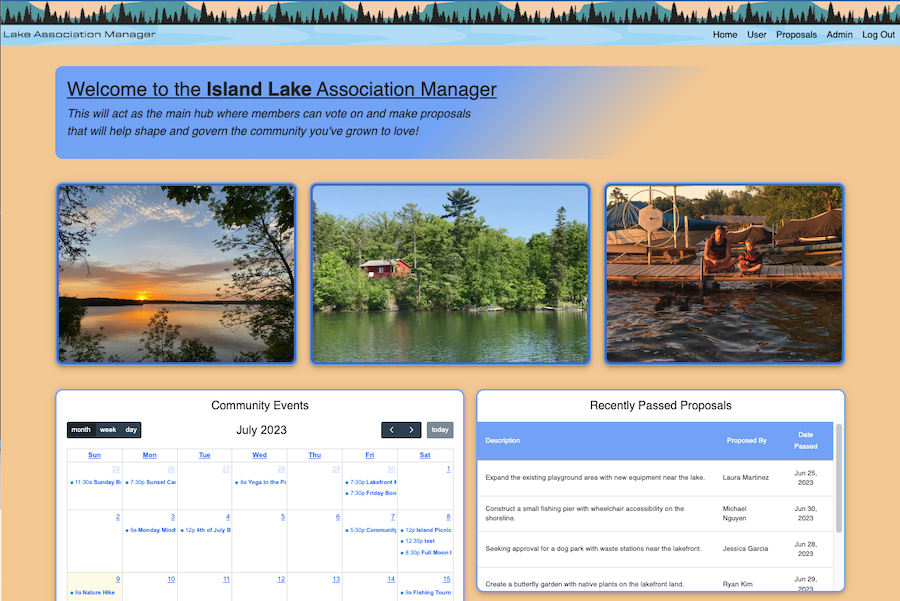

# Lake Association Manager

## Description

_Duration: 3 Week Solo Challenge_

<!-- Directly above this is how long it took you to develop the project. Your project description goes here. What problem did you solve? How did you solve it?  -->

Democratic processes can be slow and arduous when voting members of a collective don’t live near each other. My application aims to be a central hub where stakeholders in a lake association can cast their vote online for proposals that will determine the governing policies of the community. Because many members live up to a hundred miles away from the lake, and 85% agreement is required for a proposal to pass, an in person voting system could be frustrating. 

With the inclusion of current social aspects, and a plan for more features in the future. The application hopes to help foster and strengthen the communial bonds needed to maintain a vibrant community. 

<!-- To see the fully functional site, please visit: [DEPLOYED VERSION OF APP](www.heroku.com) -->

## Screen Shot

### Prerequisites

Link to software that is required to install the app (e.g. node).

- [Node.js](https://nodejs.org/en/)
- 
- List other prerequisites here

## Installation

1. Create a database named `association_manager`,
2. The queries in the `database.sql` file are set up to create all the necessary tables and populate the needed data to allow the application to run correctly. The project is built on [Postgres](https://www.postgresql.org/download/), so you will need to make sure to have that installed. We recommend using Postico to run those queries as that was used to create the queries, 
3. Open up your editor of choice and run an `npm install`
4. Run `npm run server` in your terminal
5. Run `npm run client` in your terminal
6. The `npm run client` command will open up a new browser tab for you!

## Usage
How does someone use this application? Tell a user story here.

1. Start with registering an account by entering in a key given by a board member of the association. If you don't have a key see the provided email to contact them.
2. Once the user has an account and is logged in, they will be directed to the home page.
3. From there they will see a community calendar, as well as recently passed and vetoed proposals.
4. Then on the Proposals Page the user will see a list of all active proposals that they can cast their vote on.
5. Lastly there is a user page where they can edit all of there contact information. Aswell as manage their submitted proposals and community events.
6. Admins have access to an admin page where they can see all users information, and delete any proposals or community events.

## Built With

- React JS
- Redux
- Express
- Passport JS
- PostgreSQL
- Material UI
- FullCalendar.io
- Moment JS
- CSS

## Acknowledgement
Thanks to [Emerging Digital Academy](https://emergingacademy.org/) who equipped and helped me to make this application a reality. Special thanks to Blaine Booher, Mason Leonhart, and Katie Burington.

## Support
If you have suggestions or issues, please email me at [kanwischer.garret@gmail.com](www.google.com)